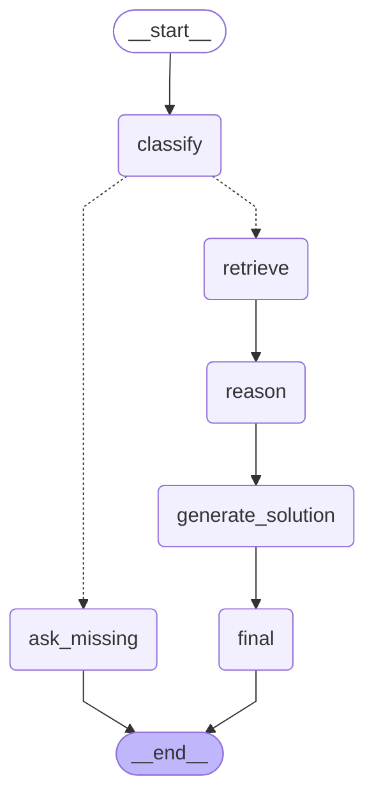

# Fault Diagnosis Graph

```mermaid
---
config:
  flowchart:
    curve: linear
---
graph TD;
	__start__([<p>__start__</p>]):::first
	classify(classify)
	ask_missing(ask_missing)
	retrieve(retrieve)
	reason(reason)
	generate_solution(generate_solution)
	final(final)
	__end__([<p>__end__</p>]):::last
	__start__ --> classify;
	classify -.-> ask_missing;
	classify -.-> retrieve;
	generate_solution --> final;
	reason --> generate_solution;
	retrieve --> reason;
	ask_missing --> __end__;
	final --> __end__;
	classDef default fill:#f2f0ff,line-height:1.2
	classDef first fill-opacity:0
	classDef last fill:#bfb6fc

```
